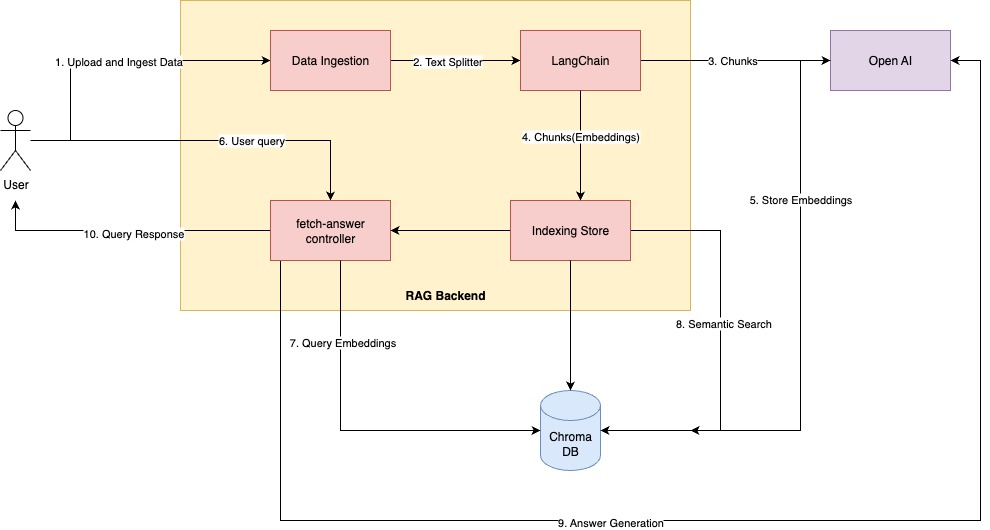

## Overview

**rag-demo** is a demonstration project showcasing Retrieval-Augmented Generation (RAG) techniques. RAG combines the power of large language models with external knowledge sources, enabling more accurate and context-aware responses. This project provides a simple, extensible framework for experimenting with RAG workflows.

## Features
- Database(Chroma) implementation
- Document ingestion and indexing
- Semantic search over ingested documents
- Context window management
- Integration with language models for answer generation
- Modular design for easy customization

## Architecture


The architecture consists of the following components:

- **Document Store (Chroma):** Stores ingested documents and their embeddings.
- **Ingestion Pipeline:** Processes and indexes documents for semantic search.
- **Semantic Search:** Retrieves relevant context from the document store based on user queries.
- **Language Model Integration(OpenAI):** Generates answers using retrieved context and user queries.
- **API Layer:** Provides endpoints for document ingestion and response generation.

This modular design allows for easy extension and customization of each component.

## Prerequisites

- Python 3.8+
- [pip](https://pip.pypa.io/en/stable/installation/)
- (Optional) [Docker](https://www.docker.com/) for containerized setup

## Installation

1. **Clone the repository:**
    ```bash
    git clone https://github.com/yourusername/rag-demo.git
    cd rag-demo
    ```

2. **Install dependencies:**
    ```bash
    pip install -r requirements.txt
    ```

## Usage

1. **Run the demo:**
    ```bash
    hypercorn run.py
    ```

2. **Prepare and ingest your documents:**
    - Upload your document(.pdf) using the 'ingest-data' api.

3. **Interact:**
    - To interact with the RAG system use the 'fetch-response' api.
    - Enter your query in the text field.
    - `session_id` has additionally been added to preserve user's context that is to maintain user's history.
    - The system retrieves relevant context and generates an answer, with appropriate format.